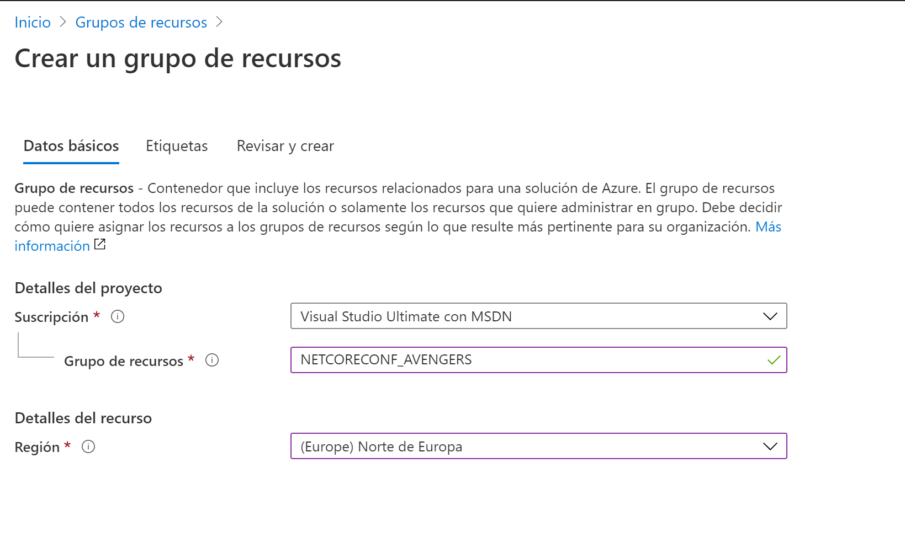
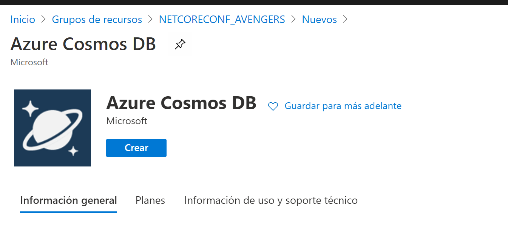
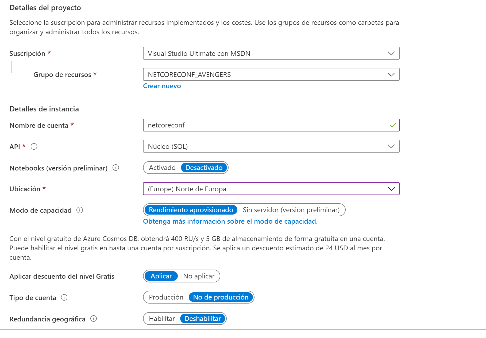
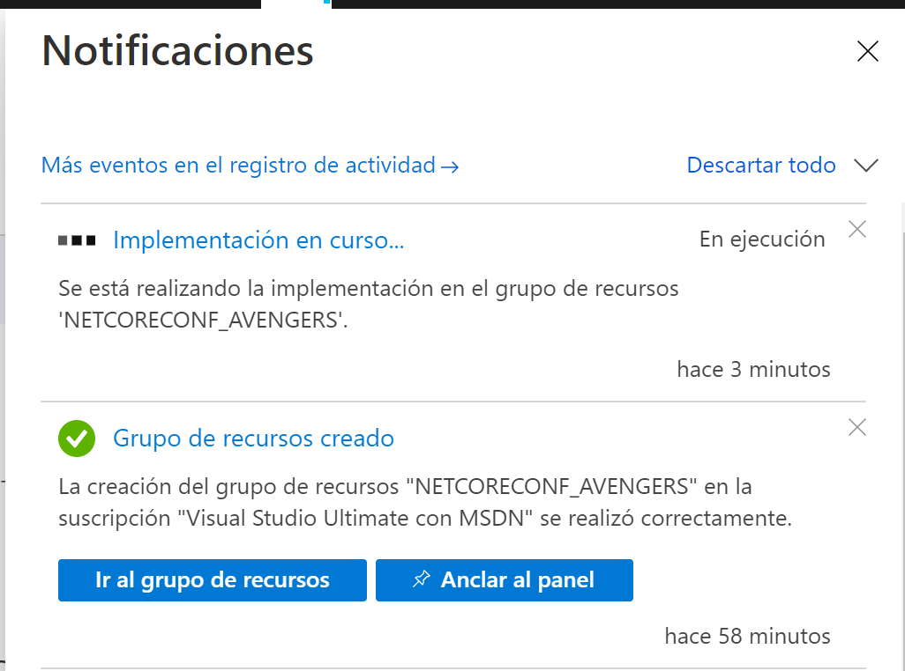
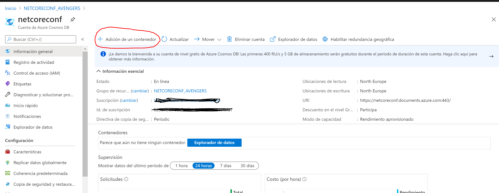
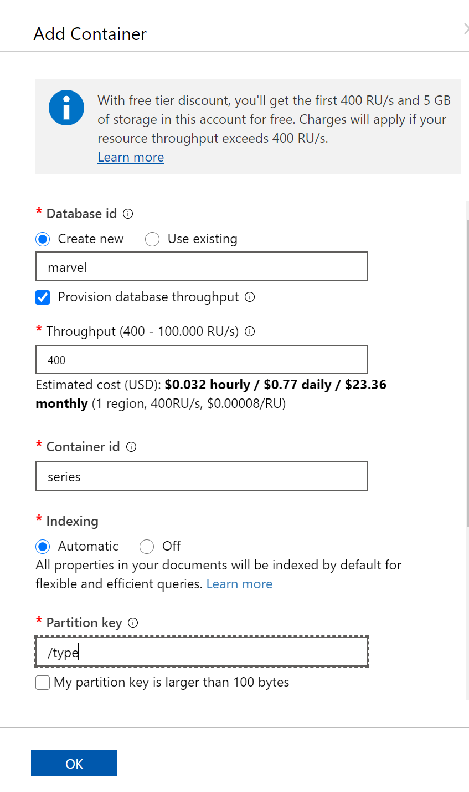
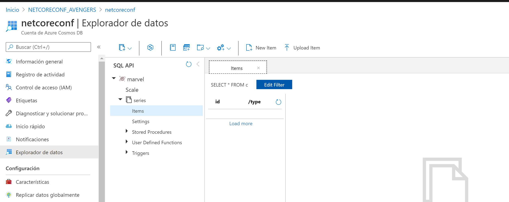
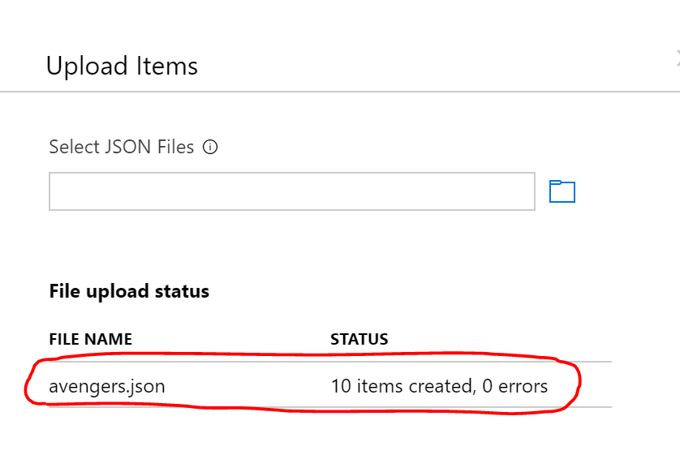

# Creando Cosmos DB en Azure

## Crear una cuenta en Azure CosmosDB 

### Prerequisitos
- Subscripción de Azure 

## Instalar el contenido del Laboratorio
1. Antes de empezar, clona el Git o descargate el repositorio desde [GitHub](https://github.com/netcoreconf/WorkshopVirtual2)
2. Abre el portal de [Azure](https://portal.azure.com).
3. Creamos un grupo de recursos 

4. Creamos el servicio de CosmosDB

Dentro de todas las opciones con las que creamos el CosmosDB debemos de tener en cuenta:
- API: CoreSQL, API for MongoDB, Cassandra, Tabla de Azure,Gremlin
- Ubicación 
- Modo de Capacidad : Rendimiento o Serverless
- Tipo de Cuenta:
- Redundancia geografica
- Escritura en varias regiones
- Availability Zones

El proceso de aprovisamiento del CosmosDB puede tardar entre 2/10 minutos dependiendo de la disponibilidad.

5. Una vez el recurso este creado, el primer paso seria crear un container

Al pulsar sobre este botón rellenaremos la siguiente información

Base de datos: marvel
Container: series
Partitionkey: type

6. Añadimos una serie de datos ya precargados que utilizaremos en los siguientes laboratorios

Pulsamos sobre "Select JSON Files" e importamos el fichero que se encuentra en este repositorio/data/avengers.json. Si todo va bien una vez se suba el fichero se deberá de mostrar un mensaje como el siguiente:

