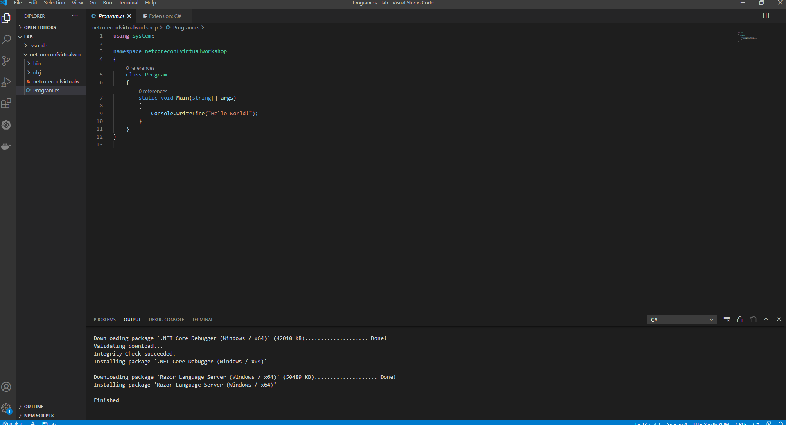
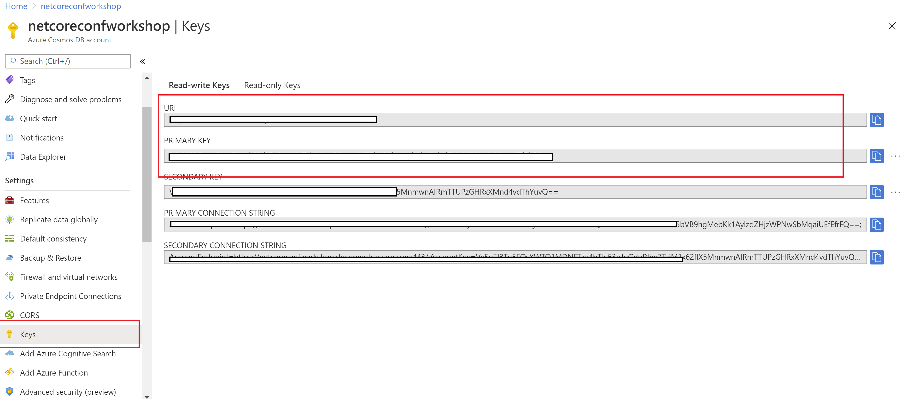

# Usando el SDK de Cosmos DB con .NET  

Una vez hecha la introducción a Cosmos DB a través del portal vamos a aprender como trabajar con el SKD de .NET

## Creando el poryecto  

1- En la carpeta donde querias contruir el lab abrir Visual Studio Code, para ello abrir la consola en el directorio desaado y ejecutar:   
> code .  

2- Abrir el terminal de vscode: 
> Ctrl+Shift+ñ o Terminal - New Terminal  

3 - Creamos el proyecto de consola:  
> dotnet new console -o "netcoreconfvirtualworkshop"  



4- Añadimos el sdk de Cosmos DB a nuestro proyecto  
> dotnet add package Microsoft.Azure.Cosmos -v 3.13.0   

## Modelo de datos de Cosmos  

Creamos una clase llamada AvengersModel.cs que contendrá nuestro modelo de Cosmos DB, y lo rellenamos con el siguiente modelo:  

```csharp

    using System;  
    using System.Collections.Generic; 
    
    namespace netcoreconfvirtualworkshop
    {
        public class AvengersModel
        {
            public string id { get; set; } 
            public string title { get; set; } 
            public string description { get; set; } 
            public string resourceURI { get; set; } 
            public List<Url> urls { get; set; } 
            public int startYear { get; set; } 
            public int endYear { get; set; } 
            public string rating { get; set; } 
            public string type { get; set; } 
            public DateTime modified { get; set; } 
            public Thumbnail thumbnail { get; set; } 
            public Creators creators { get; set; } 
            public Characters characters { get; set; } 
            public Stories stories { get; set; } 
            public Comics comics { get; set; } 
            public Events events { get; set; } 
            public object next { get; set; } 
            public object previous { get; set; } 

        }

        public class Url    {
            public string type { get; set; } 
            public string url { get; set; } 
        }

        public class Thumbnail    {
            public string path { get; set; } 
            public string extension { get; set; } 
        }

        public class Item    {
            public string resourceURI { get; set; } 
            public string name { get; set; } 
            public string role { get; set; } 
        }

        public class Creators    {
            public int available { get; set; } 
            public string collectionURI { get; set; } 
            public List<Item> items { get; set; } 
            public int returned { get; set; } 
        }

        public class Item2    {
            public string resourceURI { get; set; } 
            public string name { get; set; } 
        }

        public class Characters    {
            public int available { get; set; } 
            public string collectionURI { get; set; } 
            public List<Item2> items { get; set; } 
            public int returned { get; set; } 
        }

        public class Item3    {
            public string resourceURI { get; set; } 
            public string name { get; set; } 
            public string type { get; set; } 
        }

        public class Stories    {
            public int available { get; set; } 
            public string collectionURI { get; set; } 
            public List<Item3> items { get; set; } 
            public int returned { get; set; } 
        }

        public class Item4    {
            public string resourceURI { get; set; } 
            public string name { get; set; } 
        }

        public class Comics    {
            public int available { get; set; } 
            public string collectionURI { get; set; } 
            public List<Item4> items { get; set; } 
            public int returned { get; set; } 
        }

        public class Events    {
            public int available { get; set; } 
            public string collectionURI { get; set; } 
            public List<object> items { get; set; } 
            public int returned { get; set; } 
        }
    }
```  

## Leer un elemento desde Cosmos DB 

En este apartado vamos a ver como realizar una consulta simple.  

1- Modificamos el fichero Program.cs y copiamos el siguiente contenido:  

```csharp  
using System;
using Microsoft.Azure.Cosmos;

namespace netcoreconfvirtualworkshop
{
    public class Program
    {
        private static readonly string _endpointUri = "";
        private static readonly string _primaryKey = "";
        private static readonly string _databaseId = "";
        private static readonly string _containerId = "";

        private static CosmosClient _client;

        public static void Main(string[] args)
        {
            _client = new CosmosClient(_endpointUri, _primaryKey);

            var database = _client.GetDatabase(_databaseId);
            var container = database.GetContainer(_containerId);
        }
    }
}

```  

2- Sustituir en los valores _endpointUri y _primaryKey por los valores del apartado keys:  

  

3- En _databaseId y _containerId poner el nombre que hayais asigando en la creación del Cosmos DB  

4- Ahora añadimos las siguientes lineas:  

```csharp  
ItemResponse<AvengersModel> avengerResponse = await container.ReadItemAsync<AvengersModel>("26024", new PartitionKey("collection"));
            AvengersModel avenger = avengerResponse.Resource;
            Console.WriteLine($"Title: {avenger.title}");

```  

5- Ahora compilamos y ejectamos, para ello ejecutamos en el terminal:  
> dotnet build  
> dotnet run 

## Ejecutando una Query SQL contra una partition  

A continuación de las lineas anteriores añadimos el siguiente trzo de código:  

```csharp  
string queryWithPartitionKey = "SELECT * FROM avengers a WHERE a.type = 'collection' and IS_DEFINED(a.description) and IS_DEFINED(a.startYear)";

            FeedIterator<AvengersModel> query = container.GetItemQueryIterator<AvengersModel>(new QueryDefinition(queryWithPartitionKey), requestOptions: new QueryRequestOptions{MaxConcurrency = 1});
            foreach (AvengersModel avengerModel in await query.ReadNextAsync())
            {
                await Console.Out.WriteLineAsync($"{avengerModel.id} by {avengerModel.title}");
                foreach (Item creator in avenger.creators.items)
                {
                    await Console.Out.WriteLineAsync($"\t{creator.name} {creator.role}");
                }
                await Console.Out.WriteLineAsync();
            }

```  
Ahora compilamos y ejectamos, para ello ejecutamos en el terminal:  
> dotnet build  
> dotnet run 

El resultado obtenido debe ser similar a:  
> Title:  Superior Spider-Man Vol. 2: Otto-matic (2019)  
>26024 by  Superior Spider-Man Vol. 2: Otto-matic (2019)  
>        Christos Gage writer  
>        Mike Hawthorne penciller (cover)  
>        Lan Medina penciller  
>        Jeff Youngquist editor  
>
>20293 by 1602 Witch Hunter Angela (2016)  
>        Christos Gage writer  
>        Mike Hawthorne penciller (cover)  
>        Lan Medina penciller  
>        Jeff Youngquist editor  

Si quisieramos ejecutar la query por múltiples partitions key lo único que hay que hacer es eliminar el a.type = "collection"  de la anterior query, quedando:  

```csharp  
string queryWithPartitionKey = "SELECT * FROM avengers a WHERE  IS_DEFINED(a.description) and IS_DEFINED(a.startYear)";

            FeedIterator<AvengersModel> query = container.GetItemQueryIterator<AvengersModel>(new QueryDefinition(queryWithPartitionKey), requestOptions: new QueryRequestOptions{MaxConcurrency = 1});
            foreach (AvengersModel avengerModel in await query.ReadNextAsync())
            {
                await Console.Out.WriteLineAsync($"{avengerModel.id} by {avengerModel.title}");
                foreach (Item creator in avenger.creators.items)
                {
                    await Console.Out.WriteLineAsync($"\t{creator.name} {creator.role}");
                }
                await Console.Out.WriteLineAsync();
            }

``` 

Si ejecutamos obtenemos todas las ntradas que tengamos en el Cosomos DB.


